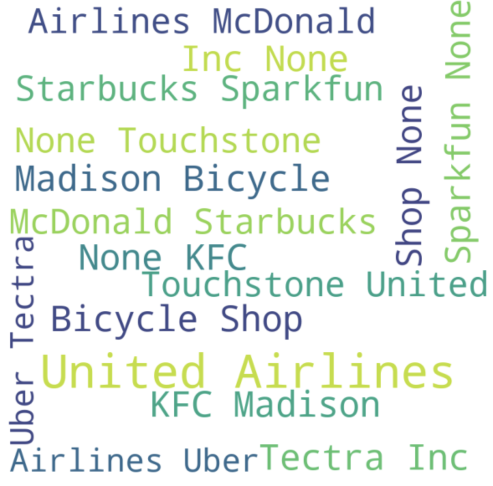
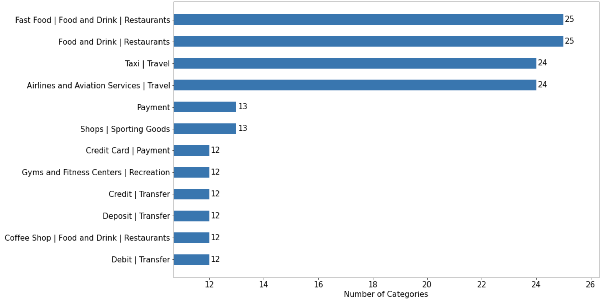
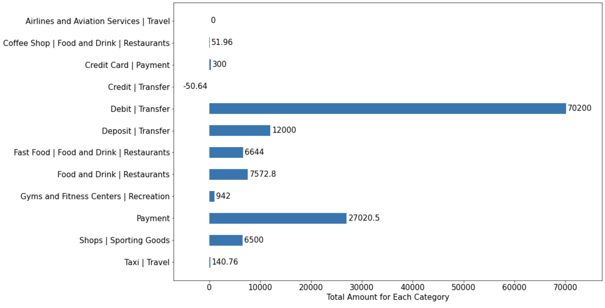
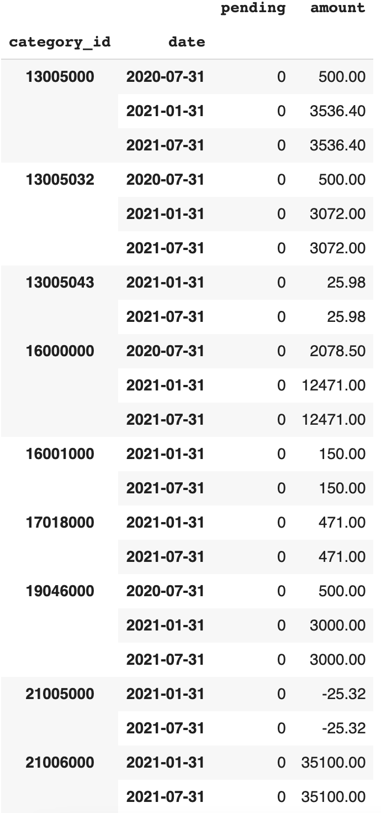
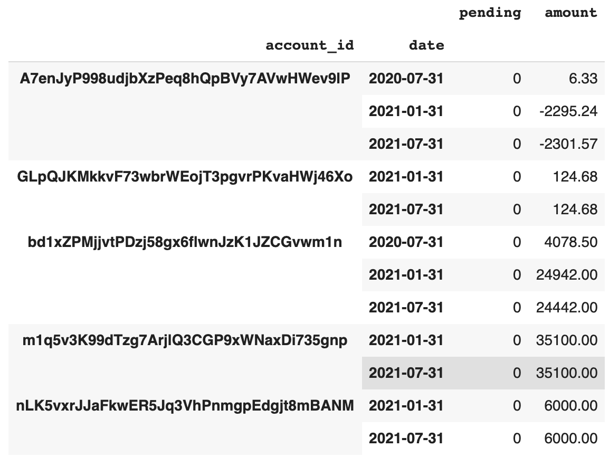

# TransactionAnalytics

## Data Extraction:
In a total of 196 transaction data with 21 attributes. With the preprocessing process,
* extracted the information from JSON file and transform it into a dataframe.
* filtered invalid information(attribute) in dataset
* make use of date information to generate insights about accounts.
* split test and training set for classification.

## Data Visualization:

<br>Firstly based on the occurrence of the merchant, printed the word cloud. Traveling and fast food like United Airlines and KFC take up a huge impact on the map.</br>
<br></br>

<br>A large number of transactions has happened on fast food restaurant and traveling expenses.</br>
<br></br>

<br>Amount attribute is the expense of each transaction. And big number transaction appears only on debit transcation and payment such as household fee and special transfers. The coffee shop and resturant only receive microtransactions. </br>
<br></br>

<br>Monthly expense per category shows the same results as the total amount of each category. But compared to 2020, the amount of expenses is higher in 2021. </br>
<br></br>

<br>As for the account analysis, 3 of them have regular expenses whereas one of the five has spent more money in 2021 from 01-05.</br>

## Classification:
<br>I collected five useful attributes, category_info,payment_channel and date info, also merchant_name and amount, to use this information to predict which account the transaction belongs to. For the 5 fold cross-validations, it reaches 87.5% of accuracy</br>

## How to use:

```bash
pip install -r requirements.txt
python start.py     #under flask-server
```
After that, access url localhost:8090 in your browser for transaction analytics and can modify the data by replacing input.json.
<br></br>

For the presentation of the results, I integrated the results with streamlit, an open resource API to generate an interactive and dynamic report about data visualization.